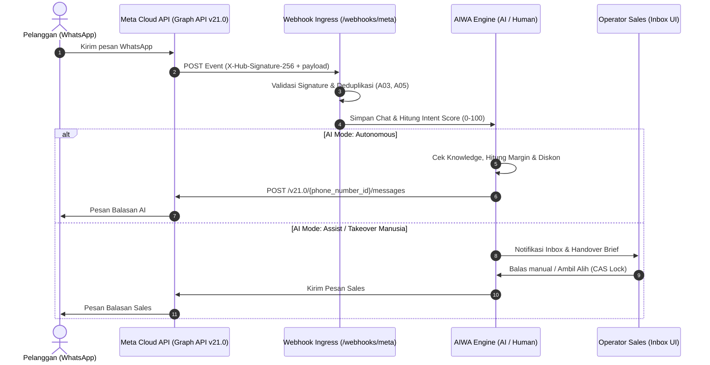

# Panduan Lengkap Integrasi Meta for Developers (WhatsApp Cloud API) ke AIWA

Dokumen ini adalah panduan langkah demi langkah (*step-by-step*) untuk menghubungkan nomor WhatsApp Bisnis resmi menggunakan **Meta WhatsApp Cloud API (Graph API)** ke platform **AIWA (ATS AI Sales Workspace)**.

---

## Daftar Isi
1. [Arsitektur Integrasi](#1-arsitektur-integrasi)
2. [Prasyarat Akun & Persiapan](#2-prasyarat-akun--persiapan)
3. [Langkah 1: Membuat Aplikasi di Meta for Developers](#langkah-1-membuat-aplikasi-di-meta-for-developers)
4. [Langkah 2: Registrasi Nomor WhatsApp Bisnis Nyata](#langkah-2-registrasi-nomor-whatsapp-bisnis-nyata)
5. [Langkah 3: Membuat Permanent System User & Access Token](#langkah-3-membuat-permanent-system-user--access-token)
6. [Langkah 4: Setup Webhook Ingress (Menerima Pesan Real-Time)](#langkah-4-setup-webhook-ingress-menerima-pesan-real-time)
7. [Langkah 5: Mengambil Meta App Secret untuk Keamanan Signature](#langkah-5-mengambil-meta-app-secret-untuk-keamanan-signature)
8. [Langkah 6: Konfigurasi File `.env` & Input Nomor di UI AIWA](#langkah-6-konfigurasi-file-env--input-nomor-di-ui-aiwa)
9. [Langkah 7: Pengujian & Validasi End-to-End](#langkah-7-pengujian--validasi-end-to-end)
10. [Troubleshooting & Aturan Resmi Meta](#troubleshooting--aturan-resmi-meta)

---

## 1. Arsitektur Integrasi



---

## 2. Prasyarat Akun & Ketentuan Nomor Telepon

Sebelum memulai, pastikan Anda telah menyiapkan:
1. **Akun Facebook Pribadi** yang aktif dan tidak terkena pembatasan.
2. **Meta Business Account (Business Manager / Portfolio)** di [business.facebook.com](https://business.facebook.com).
3. **Akun Meta for Developers** di [developers.facebook.com](https://developers.facebook.com).
4. **Status Nomor Telepon yang Ingin Didaftarkan**:
   
   Ada dua skenario untuk nomor telepon Anda:

   ### 🟢 Skenario A: Nomor Sudah Terdaftar & Tidak Mau Hapus Akun (Fitur Resmi Meta Coexistence / CoEx)
   > [!TIP]
   > **Anda TIDAK PERLU menghapus akun atau kehilangan riwayat chat!**  
   > Meta secara resmi menyediakan fitur **WhatsApp Coexistence (CoEx)**. Fitur ini memungkinkan **satu nomor telepon berjalan bersamaan di dua tempat**:
   > 1. Tetap aktif di aplikasi **WhatsApp Business di ponsel/HP** Anda (riwayat chat, grup, kontak, dan katalog tetap utuh).
   > 2. Terhubung ke **Meta WhatsApp Cloud API / AIWA** untuk automasi AI, bot sales, dan multi-agent inbox.
   > 
   > **Syarat Skenario A:** Nomor tersebut harus berada di aplikasi **WhatsApp Business App** (bukan WhatsApp Personal biasa). Jika nomor Anda saat ini masih di WhatsApp Personal biasa, cukup unduh aplikasi *WhatsApp Business* di HP dan pilih opsi migrasi data saat pertama kali buka — **seluruh chat dan kontak akan langsung berpindah ke WhatsApp Business tanpa terhapus sedikit pun**.

   ### 🟡 Skenario B: Nomor Khusus / Dedicated Cloud API (Standalone WABA)
   > Digunakan jika nomor ini adalah nomor baru / SIM card khusus customer service perusahaan yang murni dioperasikan 100% dari web dashboard AIWA tanpa perlu aplikasi WhatsApp di ponsel.

5. **Akses URL HTTPS Publik**:
   - Jika menggunakan server produksi: Domain dengan SSL valid (misal: `https://sales.perusahaan.com`).
   - Jika pengembangan lokal (*localhost*): Alat tunneling seperti **Ngrok** (`ngrok http 8000`) atau **Cloudflare Tunnel**.

---

## 3. Langkah 1: Membuat Aplikasi di Meta for Developers

1. Buka portal [Meta for Developers](https://developers.facebook.com) dan login.
2. Di pojok kanan atas, klik **My Apps** lalu klik tombol **Create App**.
3. Pada halaman pemilihan Use Case:
   - Pilih **Other** lalu klik **Next**.
   - Pilih tipe aplikasi: **Business** lalu klik **Next**.
4. Lengkapi informasi aplikasi:
   - **App Name**: Contoh: `AIWA Sales Workspace`
   - **App Contact Email**: Masukkan email developer/admin Anda.
   - **Business Portfolio**: Pilih akun Meta Business Manager perusahaan Anda.
   - Klik **Create App** (masukkan kata sandi Facebook Anda jika diminta).
5. Pada halaman *Add products to your app*:
   - Cari produk **WhatsApp**.
   - Klik tombol **Set up**.

---

## 4. Langkah 2: Menghubungkan Nomor ke Meta (Pilih Metode Anda)

### Pilihan 1: Menghubungkan Nomor Existing Tanpa Hapus Akun (Meta Coexistence)
*Gunakan cara ini jika Anda ingin nomor tetap aktif di WhatsApp Business di ponsel Anda.*

1. Pastikan nomor sudah aktif di aplikasi **WhatsApp Business** di HP (update ke versi terbaru dari Play Store / App Store).
2. Buka [Meta Business Settings](https://business.facebook.com/settings).
3. Di menu sebelah kiri, pilih **Accounts** > **WhatsApp Accounts**.
4. Klik tombol **Add** lalu pilih **Add a WhatsApp account**.
5. Masukkan nomor WhatsApp Business Anda beserta kode negara (`+62`).
6. Meta akan mengirimkan kode verifikasi 6 digit langsung ke dalam aplikasi **WhatsApp Business di ponsel Anda**.
7. Masukkan kode verifikasi tersebut di Meta Business Settings.
8. Akun WhatsApp Business Anda kini resmi terhubung ke WABA portfolio Meta!
9. Hubungkan akun WhatsApp ini ke Aplikasi Meta Developer Anda:
   - Buka menu **System Users** (ikuti [Langkah 3](#langkah-3-membuat-permanent-system-user--access-token)) dan berikan akses penuh (*Full Control*) ke akun WhatsApp tersebut.
10. Catat **Phone Number ID** dan **WhatsApp Business Account ID (WABA ID)** dari detail akun tersebut untuk dimasukkan ke AIWA.

> [!NOTE]
> Dengan metode Coexistence ini:
> - Pesan yang masuk dari pelanggan akan tampil di HP Anda **DAN** masuk ke AIWA via Webhook.
> - Pesan yang dikirim oleh AI / sales dari AIWA akan tampil juga di HP Anda.
> - Pesan yang Anda balas langsung dari HP Anda akan tersinkronisasi ke AIWA (via webhook event `smb_message_echoes`).
> - **Aturan Meta:** Aplikasi WhatsApp Business di HP minimal dibuka 1x setiap 14 hari agar token pendamping tetap aktif.

---

### Pilihan 2: Mendaftarkan Nomor Baru / Standalone WABA (Via Developer Console)
*Gunakan cara ini jika nomor murni nomor SIM card baru yang belum pernah memiliki akun WhatsApp di HP.*

1. Di Meta Developer Dashboard aplikasi Anda, buka **WhatsApp** > **API Setup**.
2. Gulir ke bawah ke bagian **Step 5: Add a phone number**.
3. Klik tombol **Add phone number**:
   - **Business Display Name**: Masukkan nama bisnis resmi (contoh: *PT Anugerah Teknik Sejahtera*).
   - **Category**: Pilih kategori bisnis Anda.
   - Klik **Next**.
4. Masukkan Nomor Telepon:
   - Pilih kode negara: **Indonesia (+62)**.
   - Masukkan nomor HP/telepon.
   - Pilih metode verifikasi OTP: **SMS** atau **Panggilan Suara**.
   - Masukkan 6 digit kode OTP yang diterima.
5. Catat **Phone Number ID** dan **WABA ID** yang tampil di bagian atas halaman API Setup.

---

## 5. Langkah 3: Membuat Permanent System User & Access Token

> [!WARNING]
> Token yang ada di halaman *API Setup* (Temporary Access Token) **akan kedaluwarsa setelah 24 jam**.
> Untuk sistem produksi AIWA, Anda **WAJIB** membuat **System User Access Token permanen** yang tidak pernah kedaluwarsa.

Ikuti langkah-langkah berikut:

1. Buka **Meta Business Suite / Business Settings**:
   - Kunjungi [https://business.facebook.com/settings](https://business.facebook.com/settings).
   - Pilih akun bisnis Anda yang terhubung dengan aplikasi tadi.
2. Masuk ke menu **Users** > **System users** di sidebar kiri.
3. Klik tombol **Add**:
   - **System username**: Contoh: `aiwa-system-user`
   - **System user role**: Pilih **Admin**.
   - Klik **Create system user**.
4. Tambahkan hak akses aset (*Assign Assets*):
   - Klik pada nama system user yang baru dibuat, lalu klik tombol **Assign assets**.
   - Di kolom kiri, pilih **Apps** > Pilih aplikasi yang Anda buat di Langkah 1 > Aktifkan toggle **Manage app** (*Full control*).
   - Di kolom kiri, pilih **WhatsApp Accounts** > Pilih akun WABA Anda > Aktifkan toggle **Manage WhatsApp business account** (*Full control*).
   - Klik **Save changes**.
5. Hasilkan Token Permanen (*Generate Token*):
   - Klik tombol **Generate new token**.
   - Pilih aplikasi Anda.
   - Pada pilihan **Token expiration**, pilih **Never** (Permanen).
   - Pada daftar **Available permissions**, centang 2 izin wajib:
     - ✅ `whatsapp_business_messaging`
     - ✅ `whatsapp_business_management`
   - Klik tombol **Generate token**.
6. Simpan Token:
   - Salin token yang diawali dengan `EAAG...` tersebut dan simpan di catatan yang aman (token ini hanya ditampilkan satu kali oleh Meta).

---

## 6. Langkah 4: Setup Webhook Ingress (Menerima Pesan Real-Time)

Webhook berfungsi agar Meta dapat mengirimkan pesan masuk dari pelanggan langsung ke server AIWA secara *real-time*.

### A. Untuk Lingkungan Lokal (Development / Staging via Tunneling)
Jika Anda menjalankan AIWA di localhost (`http://127.0.0.1:8000`):
1. Install dan jalankan **Ngrok**:
   ```bash
   ngrok http 8000
   ```
2. Salin URL HTTPS publik yang diberikan oleh Ngrok, misalnya:
   ```text
   https://abcd-1234-5678.ngrok-free.app
   ```

### B. Mendaftarkan Webhook di Meta Developer Dashboard
1. Buka kembali dashboard aplikasi Anda di [developers.facebook.com](https://developers.facebook.com).
2. Di sidebar kiri, klik **WhatsApp** > **Configuration**.
3. Pada bagian **Webhook**, klik tombol **Edit**:
   - **Callback URL**:
     ```text
     https://abcd-1234-5678.ngrok-free.app/webhooks/meta
     ```
     *(Jika sudah di server produksi, gunakan domain Anda: `https://domain-anda.com/webhooks/meta`)*
   - **Verify Token**:
     ```text
     ats_verify_token_2026
     ```
     *(Nilai ini harus cocok persis dengan `META_VERIFY_TOKEN` di file `.env` AIWA).*
4. Klik **Verify and save**.
   > [!NOTE]
   > Meta akan mengirimkan request `GET` ke endpoint tersebut dengan parameter `hub.challenge`. Server AIWA akan memverifikasi token dan langsung mengembalikan HTTP 200 dengan nilai challenge.

5. Berlangganan Event Pesan (*Webhook Fields*):
   - Setelah Callback URL tersimpan, di bawahnya terdapat tabel **Webhook fields**.
   - Klik **Manage**.
   - Cari field bernama **`messages`**.
   - Klik tombol **Subscribe** pada baris `messages`.
   - Klik **Done**.

---

## 7. Langkah 5: Mengambil Meta App Secret untuk Keamanan Signature

AIWA mengimplementasikan pengamanan kriptografis **HMAC-SHA256** pada header `X-Hub-Signature-256` di setiap webhook pesan masuk untuk mencegah pemalsuan pesan (*spoofing* / Acceptance Test A05).

1. Di Meta Developer Dashboard aplikasi Anda, buka menu **App settings** > **Basic** di sidebar kiri.
2. Cari kolom **App Secret**.
3. Klik tombol **Show** (masukkan kata sandi akun Facebook Anda jika diminta).
4. Salin string App Secret tersebut (contoh: `d41d8cd98f00b204e9800998ecf8427e`).

---

## 8. Langkah 6: Konfigurasi File `.env` & Input Nomor di UI AIWA

### A. Pengaturan File `.env`
Buka file `.env` di direktori utama proyek AIWA dan sesuaikan variabel Meta:

```env
# ==============================================================================
# META WHATSAPP CLOUD API CONFIGURATION
# ==============================================================================
META_GRAPH_VERSION=v21.0
META_APP_ID=123456789012345
META_APP_SECRET=d41d8cd98f00b204e9800998ecf8427e
META_VERIFY_TOKEN=ats_verify_token_2026
META_SYSTEM_USER_TOKEN=EAAG...salin_permanent_token_dari_langkah_3_disini...
```

Setelah mengubah file `.env`, bersihkan cache config Laravel:
```bash
php artisan config:clear
```

---

### B. Mendaftarkan Nomor di Antarmuka AIWA
1. Buka browser dan akses aplikasi AIWA: `http://127.0.0.1:8000/app/numbers`.
2. Klik tombol **+ Tambah Nomor**.
3. Isi data pada formulir:
   - **Label Nomor**: Contoh: `ATS Sales Official — Schneider Electric`
   - **Nomor WhatsApp (Format E.164)**: `+6281234567890` (wajib diawali tanda `+` dan kode negara).
   - **Provider**: Pilih **Meta Cloud API (Official)**.
   - **Phone Number ID**: Masukkan ID dari Langkah 2 (contoh: `108293847561029`).
   - **WABA ID**: Masukkan ID WABA dari Langkah 2 (contoh: `982736451029384`).
   - **Secret Token / Reference**: Masukkan System User Access Token permanen yang dibuat di Langkah 3.
   - **Mode AI Awal**:
     - `autonomous`: AI otomatis merespons pesan pelanggan berdasarkan katalog produk & margin rule.
     - `assist`: Pesan masuk ke Inbox sales, AI memberikan draf saran jawaban.
     - `off`: AI nonaktif, murni ditangani oleh manusia.
   - **Manusia Utama & Tim Backup**: Pilih operator sales penanggung jawab utama dan backup.
4. Klik **Simpan Nomor WhatsApp**.
5. Status nomor akan langsung berubah menjadi **Connected** (Hijau).

> [!IMPORTANT]
> Sesuai aturan **A26**, jika nomor didaftarkan dengan provider `meta` namun Phone Number ID atau Token dikosongkan, nomor akan berstatus `draft` dan tidak akan mengirim atau menerima pesan.

---

## 9. Langkah 7: Pengujian & Validasi End-to-End

### 1. Uji Verifikasi Webhook Mandiri (GET Challenge)
Anda dapat memverifikasi bahwa endpoint webhook merespons dengan benar melalui cURL atau browser:

```bash
curl -X GET "http://127.0.0.1:8000/webhooks/meta?hub.mode=subscribe&hub.verify_token=ats_verify_token_2026&hub.challenge=test_token_sukses"
```
**Respons yang diharapkan:** `test_token_sukses` dengan HTTP status `200 OK`.

---

### 2. Uji Pesan Masuk dari HP Pelanggan
1. Dari nomor WhatsApp pribadi Anda (HP lain), kirimkan pesan ke nomor WhatsApp bisnis yang baru saja didaftarkan:
   ```text
   Halo, saya butuh penawaran MCB Schneider Domae 1P 16A sebanyak 20 unit. Bisa minta harga diskon?
   ```
2. Buka antarmuka AIWA di browser pada menu **Inbox Multiagen** (`/app/inbox`):
   - Percakapan baru akan otomatis muncul secara *real-time*.
   - Nilai **Intent Score** akan terdeteksi tinggi (misal: 65–85) karena mengandung SKU spesifik, kuantitas, dan permintaan penawaran harga.
   - Jika nomor disetel ke mode `autonomous`, bot AIWA akan langsung menghitung diskon kuantitas dari katalog dan membalas pesan WhatsApp ke nomor HP pengirim dalam beberapa detik.
3. Di panel kanan, Anda dapat melihat **Handover Brief**:
   - Profil pelanggan
   - Intent Score & riwayat penawaran terakhir
   - Tombol **Ambil Alih Percakapan (Takeover)** untuk beralih ke operator manusia seketika.

---

## 10. Troubleshooting & Aturan Resmi Meta

| Gejala / Error | Penyebab | Solusi |
|---|---|---|
| **403 Forbidden saat Verifikasi Webhook** | Nilai `hub_verify_token` yang dimasukkan di Meta Developer Dashboard tidak cocok dengan `META_VERIFY_TOKEN` di file `.env`. | Samakan nilai verify token di Meta Dashboard dan file `.env` (default: `ats_verify_token_2026`). Jalankan `php artisan config:clear`. |
| **403 Invalid webhook signature** | Nilai `META_APP_SECRET` di file `.env` salah atau tidak cocok dengan App Secret di Meta Developer Dashboard. | Periksa kembali **App settings > Basic > App Secret** di Meta Dashboard, salin dan tempelkan ke `META_APP_SECRET` di `.env`. |
| **Pesan keluar gagal dikirim (Failed / Error 190 OAuthException)** | Access Token telah kedaluwarsa (biasanya karena menggunakan Temporary Token 24 jam) atau hak akses belum dicentang. | Buat System User Token permanen dengan opsi expiration **Never** dan permission `whatsapp_business_messaging` serta `whatsapp_business_management` (lihat Langkah 3). |
| **Nomor tidak dapat ditambahkan di API Setup ("Phone number already registered")** | Anda mencoba menambahkan nomor yang sudah aktif di WhatsApp ponsel lewat form *Add phone number* biasa. | **Jangan hapus akun Anda!** Gunakan jalur **Meta Coexistence**: Tambahkan nomor tersebut melalui **Meta Business Settings > Accounts > WhatsApp Accounts > Add**, lalu verifikasi kode OTP yang masuk ke aplikasi WhatsApp Business di ponsel Anda (lihat [Langkah 2 - Pilihan 1](#pilihan-1-menghubungkan-nomor-existing-tanpa-hapus-akun-meta-coexistence)). |
| **Pesan teks bebas ditolak setelah 24 jam (A09)** | Kebijakan resmi Meta: Jendela Layanan Pelanggan (*Customer Service Window*) hanya 24 jam dari pesan terakhir pelanggan. | Setelah 24 jam, pengiriman pesan hanya diizinkan menggunakan **WhatsApp Message Template** yang telah disetujui (*Approved*) oleh Meta. |
| **Status nomor tetap "Draft" di AIWA** | Kredensial nomor (`phone_number_id` atau token) belum diisi lengkap saat menyimpan nomor. | Edit nomor dan lengkapi Phone Number ID serta WABA ID sesuai data di Meta Developer Console. |

---

## Tautan & Referensi Resmi
- [Meta WhatsApp Cloud API Overview](https://developers.facebook.com/docs/whatsapp/cloud-api)
- [Meta Webhooks for WhatsApp](https://developers.facebook.com/docs/whatsapp/cloud-api/webhooks)
- [Penetapan Harga & Batas Percakapan WhatsApp Business](https://developers.facebook.com/docs/whatsapp/pricing)
- [Dokumentasi Kebijakan AI Sales & Margin AIWA](docs/ai-sales-policy.md)
- [Dokumentasi Human Takeover & Pagar Atomik AIWA](docs/human-takeover.md)
